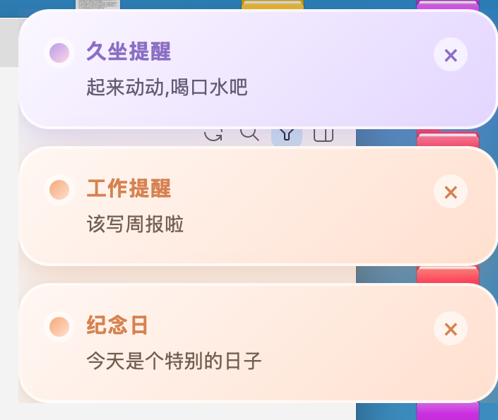

# MacaBell 🌈

<div align="center">



<br />

**一个用 Tauri 2 + React + TypeScript + Rust 写的马卡龙色 Mac 菜单栏提醒小工具。**

到点后，从屏幕右上角滑入一个温和的糖果色小弹窗，提醒你该休息、该做事，或者别忘了某个重要日子——并正在逐步演进成「AI 编程工作流的本地任务收件箱」。

<br />

<a href="https://github.com/yixiao-lab/MacaBell/releases/latest">
  
</a>
<a href="https://github.com/yixiao-lab/MacaBell/stargazers">
  
</a>
<a href="https://github.com/yixiao-lab/MacaBell/blob/main/LICENSE">
  
</a>
<a href="https://github.com/yixiao-lab/MacaBell/releases">
  
</a>

<br />
<br />


<br />
<br />

<a href="https://yixiao-lab.github.io/MacaBell/"><strong>官网</strong></a>
&nbsp;&nbsp;·&nbsp;&nbsp;
<a href="https://github.com/yixiao-lab/MacaBell/releases/latest"><strong>下载</strong></a>
&nbsp;&nbsp;·&nbsp;&nbsp;
<a href="#快速开始"><strong>快速开始</strong></a>
&nbsp;&nbsp;·&nbsp;&nbsp;
<a href="#路线图"><strong>路线图</strong></a>
&nbsp;&nbsp;·&nbsp;&nbsp;
<a href="#参与贡献"><strong>参与贡献</strong></a>

<br />
<br />

<a href="./README.md">English</a> &nbsp;·&nbsp; **简体中文**

</div>

<br />

## MacaBell 是什么？

MacaBell 是一个很小、本地优先的 Mac 菜单栏提醒小工具。

到点后，一个糖果色的小弹窗会从屏幕右上角滑入，提醒你该休息、该做事，或者别忘了某个重要日子。

没有账号，没有云同步，没有埋点追踪，没有订阅。你的全部配置就是一个本地 JSON 文件——简单、直接、够用。

<br />

## 为什么是 MacaBell？

大多数提醒应用会慢慢长成沉重的效率系统：账号、云同步、协作、订阅、复杂工作流。

MacaBell 走更小的那条路。

它专注于一个安静的本地菜单栏体验、好看的弹窗、三种诚实的提醒类型，以及一份小到任何开发者都能读懂、能 fork、能改成自己菜单栏工具的代码。

<br />

## 界面预览

到点后从屏幕右上角滑入糖果色小弹窗。同一时间多条提醒会自动堆叠、互不覆盖，每条都能单独关掉。

<table>
  <tr>
    <td width="50%">
      
      <p align="center"><strong>单条提醒</strong></p>
    </td>
    <td width="50%">
      
      <p align="center"><strong>多条堆叠</strong></p>
    </td>
  </tr>
</table>

<br />

## 特点

- **马卡龙风格** — 6 套糖果配色每次随机，看着舒服、不焦虑、不打扰心流。
- **常驻菜单栏** — 没有主窗口，只在顶部菜单栏放一个小图标。
- **不抢焦点** — 弹窗不夺取键盘焦点，随手点掉即可。
- **多提醒堆叠** — 同一时间多条提醒不会互相覆盖。
- **本地 JSON 配置** — 单一文件 `~/.MacaBell/reminders.json`，所见即所得。
- **配置错误提示** — JSON 写错时会给出温和提示，修好后自动恢复。
- **三类提醒** — 每日定时 / 固定间隔 / 每年纪念日。
- **柔和提示音** — 带全局开关，可在托盘菜单里随时切换。
- **开机自启** — 一键开启，登录即常驻。
- **Universal DMG** — 同时支持 Apple Silicon 和 Intel Mac。
- **命令行通知** — `macabell notify` 让脚本和 AI 编程工具发送本地任务事件，带 ✅ / ❌ / ⏳ 状态图标。
- **Claude Code / Codex 就绪** — 接入 hooks，长任务完成时自动弹窗通知。

<br />

## 下载与安装

前往 Releases 页面下载最新版 macOS `.dmg`：

**https://github.com/yixiao-lab/MacaBell/releases/latest**

把 MacaBell 拖进「应用程序」文件夹，然后启动。

### 首次在 macOS 打开

MacaBell 目前是未签名的开源构建（还没做 Apple 付费签名公证）。

如果首次打开提示「无法验证开发者」或「应用已损坏」：

1. 在「应用程序」里右键点 MacaBell → **打开**，再点一次**打开**。
2. 如果仍不行，在终端执行一次：

```bash
xattr -dr com.apple.quarantine /Applications/MacaBell.app
```

后续若有足够需求，会考虑做签名 + 公证版本。

<br />

## 快速开始

### 1. 启动 MacaBell

安装后，MacaBell 会出现在菜单栏。首次启动会在 `~/.MacaBell/reminders.json` 生成默认配置。

### 2. 打开配置文件

从托盘菜单：

```text
MacaBell → 打开配置文件
```

也可以直接编辑：

```bash
~/.MacaBell/reminders.json
```

### 3. 编辑你的提醒

```json
{
  "soundEnabled": true,
  "reminders": [
    {
      "id": "work-report",
      "type": "daily",
      "time": "14:00",
      "title": "工作提醒",
      "message": "该写周报啦"
    },
    {
      "id": "drink-water",
      "type": "interval",
      "everyMinutes": 60,
      "title": "喝水提醒",
      "message": "喝口水，顺便放松一下肩颈"
    },
    {
      "id": "anniversary",
      "type": "anniversary",
      "date": "06-15",
      "time": "09:00",
      "title": "纪念日",
      "message": "今天是个特别的日子"
    }
  ]
}
```

保存即可，无需重启。MacaBell 后台每 20 秒读取一次最新配置。

更多示例见 [`examples/reminders.json`](examples/reminders.json)。

<br />

## 提醒配置

MacaBell 支持三种提醒类型。

| 类型 | 用途 | 关键字段 |
| --- | --- | --- |
| `daily` | 每日固定时间点 | `time`（`"14:00"`） |
| `interval` | 固定间隔循环 | `everyMinutes`（`60`） |
| `anniversary` | 每年某月某日 | `date`（`"06-15"`），可选 `time` |

### 每日定时

```json
{
  "id": "morning-exercise",
  "type": "daily",
  "time": "08:00",
  "title": "晨间锻炼",
  "message": "做点简单运动"
}
```

### 固定间隔

```json
{
  "id": "stand-up",
  "type": "interval",
  "everyMinutes": 90,
  "title": "久坐提醒",
  "message": "起来走一走，别让身体卡在椅子上"
}
```

### 每年纪念日

```json
{
  "id": "birthday",
  "type": "anniversary",
  "date": "12-25",
  "time": "09:00",
  "title": "生日",
  "message": "今天有人过生日，记得送上祝福"
}
```

<br />

## 命令行任务通知

从 v0.3.0 开始，脚本和开发工具可以向 MacaBell 发送本地任务通知：

```bash
macabell notify --source codex --project my-app --status done --message "构建完成"
```

MacaBell 运行时会立即弹出马卡龙色弹窗。一切保持本地 —— 事件只是 `~/.MacaBell/events/` 下的 JSON 文件，没有网络，没有账号。

先做一次软链接，拿到 `macabell` 命令：

```bash
sudo ln -sf /Applications/MacaBell.app/Contents/MacOS/MacaBell /usr/local/bin/macabell
```

参数说明：

| 参数 | 说明 |
| --- | --- |
| `--message` | 弹窗正文（与 `--title` 至少填一个） |
| `--title` | 弹窗标题，缺省由 `source · project` 拼出 |
| `--source` | 事件来源，如 `claude-code`、`codex`、`ci` |
| `--project` | 所属项目 |
| `--status` | `done` / `failed` / `pending`，正文前显示 ✅ / ❌ / ⏳ |

接入 Shell 脚本或构建步骤：

```bash
pnpm build && macabell notify --source ci --project "$(basename "$PWD")" --status done --message "构建通过" \
  || macabell notify --source ci --project "$(basename "$PWD")" --status failed --message "构建失败"
```

更多用法见 [docs/CLI.md](docs/CLI.md)。

<br />

## 菜单栏

点击菜单栏的马卡龙图标：

- **测试提醒一下** — 立刻弹一条，确认效果。
- **打开配置文件** — 直接打开 `reminders.json`。
- **在 Finder 中显示配置** — 定位配置文件所在位置。
- **开启提醒声音** — 声音开关，写回配置文件。
- **开机自动启动** — 登录时自动常驻。
- **退出**

<br />

## 开发

### 环境要求

Node.js、pnpm、Rust，以及 macOS 下的 Tauri 前置依赖。

```bash
pnpm install
pnpm tauri dev
pnpm tauri build
```

本地构建 Universal macOS DMG：

```bash
./scripts/build-universal-macos.sh
```

> 改了 `src-tauri/icons/` 里的图标后，记得先 `touch src-tauri/build.rs` 再重新编译，否则 cargo 不会重新嵌入图标。

<br />

## 发布

推送 tag 后，GitHub Actions 会自动打包 Universal macOS DMG 并创建 draft release：

```bash
git tag v0.3.0
git push origin v0.3.0
```

更多说明见 [`docs/RELEASE.md`](docs/RELEASE.md)。

<br />

## 项目结构

```text
MacaBell
├── src/                  React 弹窗界面（App.tsx）
├── src-tauri/src/
│   ├── lib.rs            托盘、调度、事件消费、弹窗控制
│   ├── cli.rs            `macabell notify` CLI——写入事件到 ~/.MacaBell/events/
│   └── main.rs           入口——路由 CLI 与 GUI
├── scripts/              构建与测试脚本
├── examples/             示例提醒配置
├── assets/               截图与视觉资源
├── docs/                 官网、发布说明、CLI 文档
└── .github/workflows/    GitHub Actions 发布流程
```

<br />

## 路线图

MacaBell 从一个轻量提醒应用起步，长期方向是 **AI 编程工作流的本地任务收件箱**——一个安静的本地角落，让脚本、构建任务、AI 编程工具把你真正想看到的事件投递进来。

全程保持本地优先、轻量、隐私友好、开源。

<table>
  <tr>
    <td width="22%"><strong>v0.2 ✅</strong></td>
    <td>Universal macOS 构建、GitHub Actions 自动打包、示例配置、友好的错误提示、多提醒堆叠，以及更方便地打开配置文件。</td>
  </tr>
  <tr>
    <td><strong>v0.3 ✅</strong></td>
    <td><code>macabell notify</code> 命令行通知——Shell 脚本、构建步骤、AI 编程工具（Claude Code、Codex）可以向 MacaBell 发送带状态图标和项目上下文的任务事件。</td>
  </tr>
  <tr>
    <td><strong>v0.4</strong></td>
    <td>探索面向长任务的本地任务收件箱——事件历史、任务状态，以及「打开项目 / 复制信息」等简单操作。</td>
  </tr>
  <tr>
    <td><strong>未来</strong></td>
    <td>探索与 AI 编程工作流的集成：Codex、Claude Code、Cursor、Shell 脚本、构建任务、部署任务——仅当真实开发者觉得有用时才做。</td>
  </tr>
</table>

<br />

## 未来方向

MacaBell 今天既是一个提醒工具，也是开发工具的本地通知终端。

从 v0.3.0 起，AI 编程工具和脚本已经可以通过 `macabell notify` 发送任务通知。下一步是**本地任务收件箱**——带事件历史和任务状态，让你回来后能回顾发生了什么。

### Claude Code 集成

把 MacaBell 接入 Claude Code hooks，任务完成时自动弹窗：

```jsonc
// ~/.claude/settings.json
{
  "hooks": {
    "Stop": [
      {
        "hooks": [
          {
            "type": "command",
            "command": "$HOME/.claude/hooks/macabell-notify.sh",
            "timeout": 5
          }
        ]
      }
    ]
  }
}
```

hook 脚本从工作目录提取项目名，发送马卡龙色弹窗：

```bash
#!/bin/bash
# ~/.claude/hooks/macabell-notify.sh
INPUT=$(cat)
CWD=$(echo "$INPUT" | python3 -c "import sys,json; print(json.loads(sys.stdin.read()).get('cwd',''))" 2>/dev/null || echo "")
PROJECT=$(basename "${CWD:-unknown}")
macabell notify --source claude-code --project "$PROJECT" --status done \
  --title "Claude Code · $PROJECT" --message "Claude Code 任务完成"
```

这个方向只会在真实开发者觉得有用时才扩展。全程保持本地优先：不做账号、不做云同步、不做团队协作。

<br />

## 技术栈

| | |
| --- | --- |
| **Tauri 2** | 原生桌面外壳与 macOS 集成。 |
| **React** | 提醒弹窗界面。 |
| **TypeScript** | 前端应用逻辑。 |
| **Rust** | 托盘菜单、调度逻辑、本地文件操作、原生行为。 |

<br />

## 参与贡献

欢迎贡献、issue、想法和反馈——bug 修复、文档、打包改进、示例配置，以及任何能让应用保持轻量的小优化。

提交 PR 前，请先阅读 [`CONTRIBUTING.md`](CONTRIBUTING.md)。

<br />

## 支持一下

如果 MacaBell 帮到了你，或为你自己的 Tauri 菜单栏应用提供了一个好起点：

- ⭐ **Star** 仓库，帮助更多开发者发现它。
- 🐛 **提 issue** 如果你遇到 bug 或困惑的行为。
- 💡 **提建议** 一个聚焦的小改进。
- 🔁 **分享** 给正在做 macOS 菜单栏工具的人。

<br />

## Star 历史

<a href="https://www.star-history.com/#yixiao-lab/MacaBell&Date">
  <picture>
    <source media="(prefers-color-scheme: dark)" srcset="https://api.star-history.com/svg?repos=yixiao-lab/MacaBell&type=Date&theme=dark" />
    <source media="(prefers-color-scheme: light)" srcset="https://api.star-history.com/svg?repos=yixiao-lab/MacaBell&type=Date" />
    
  </picture>
</a>

<br />

## License

基于 **MIT License** 发布。详见 [`LICENSE`](LICENSE)。

<br />

## 作者

由 **Yixiao Lab** 构建。

- GitHub: https://github.com/yixiao-lab
- 项目: https://github.com/yixiao-lab/MacaBell
